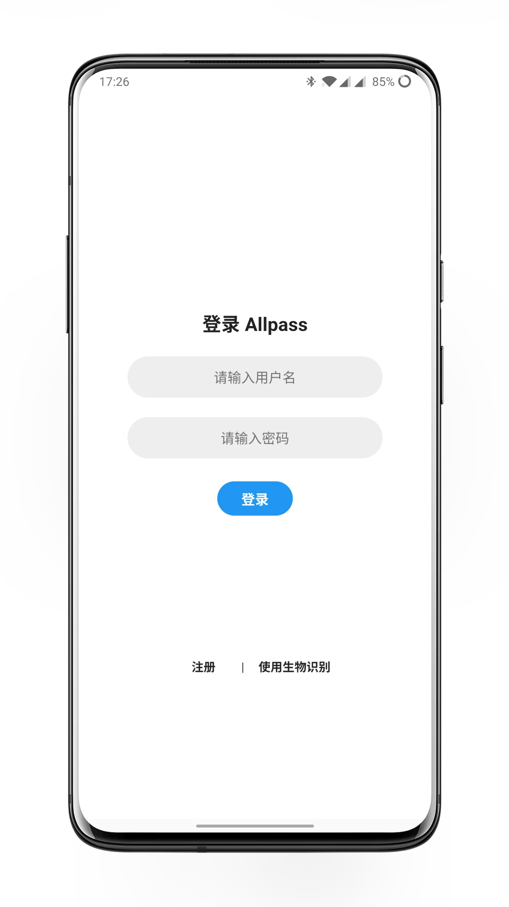
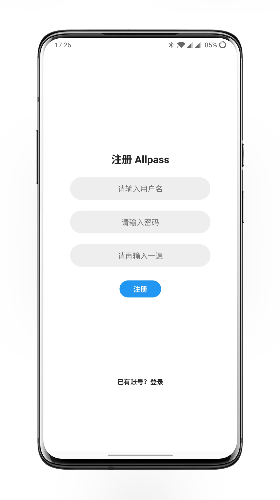
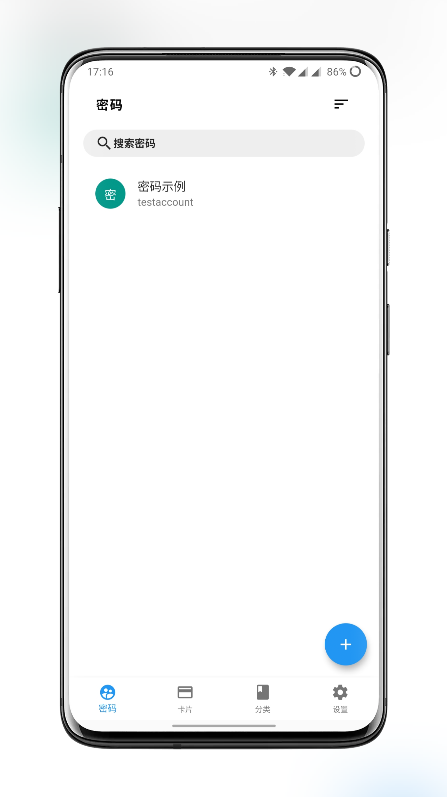
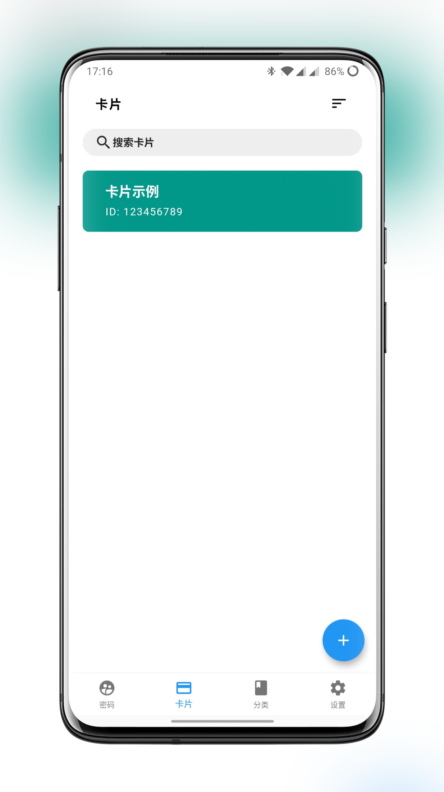
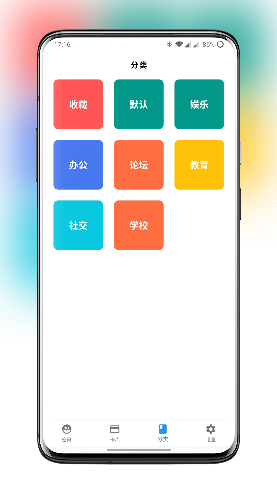
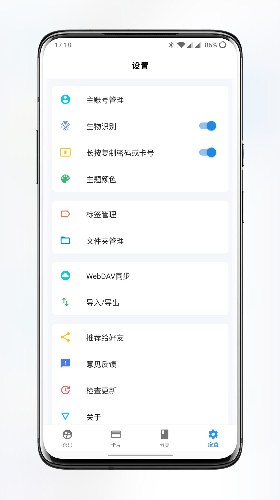
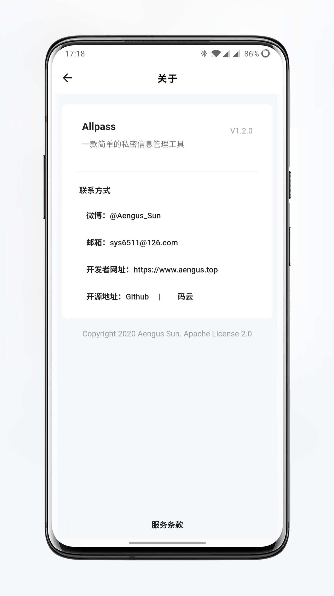

# Allpass

## 介绍


[Allpass](https://allpass.aengus.top)是一款简单的私密数据管理工具，包括支持密码存储与卡片信息存储。采用Flutter构建，目前完成了针对安卓的适配。

- 密码与卡片信息管理
- 支持指纹解锁软件
- AES256位加密
- 支持从csv文件中导入或导出为csv文件
- 支持从Chrome中导入密码
- 支持从剪贴板中导入密码
- 文件夹与标签功能
- 收藏功能
- 备注功能
- 密码生成器
- 多选编辑功能
- WebDAV同步功能
- 加密密钥更新
- 自动切换主题

# 构建Allpass

若有一些莫名其妙的编译错误，请尝试执行`flutter clean`并重启IDE。

## Android

1. 修改`lib/utils/encrypt_util.dart`中的`_key`（32位字符串），此字符串将作为初始密钥；
2. 运行`keytool -genkey -alias keyAlias -keyalg RSA -validity 20000 -keystore release.jks`
   生成密钥，其中`keyAlias`与`release.jks`可以自定义，生成的文件在命令行运行所在目录；
3. 依次将`keyAlias`, `storePassword`, `keyPassword`
   填写到android/app/config/default.properties中，并将`release.jks`替换到config文件夹中；

## iOS

TODO

**作者发布的Allpass已签名。所以如果在已安装作者发布的Allpass的情况下，安装自己构建的程序，请先卸载，否则可能导致安装失败或者密码数据丢失。
**

# 软件截图

|    |       |  |
|:---------------------------------:|-----------------------------------------|------------------------------------|
|     |  |     |
|  |          |                                    |

# 下载体验

可以在Github Release页、扫描下面的二维码或者[点此下载](https://www.pgyer.com/624679667fcbb8c8072a884b899690e3)


(目前使用蒲公英内测模式进行分发，每天下载次数限制为500次，如遇到无法下载的情况可在Github Release页进行下载)

# 未来规划

- ~WebDAV同步功能~（已完成）
- ~多选编辑功能~（已完成）
- 自动填充
- 自动获取网站favicon作为密码头像
- 智能识别网址生成名称

## 命名规范

### Dart文件

1. dart文件采用下划线命名方式；
2. 类采取大驼峰命名法，变量、常量、函数名采用小驼峰命名法；
3. 导包as后的名称使用小写+下划线；

### 数据库相关

1. 数据库表名使用下划线命名方式，且表名开头的第一个单词为`allpass`；
2. 表的列名与model相同，采用小写驼峰命名方式；

# 仓库地址

| 位置     | 地址                                                                                 |
|--------|------------------------------------------------------------------------------------|
| Github | [https://github.com/sunyongsheng/Allpass](https://github.com/sunyongsheng/Allpass) |
| 码云     | [https://gitee.com/sunyongsheng/Allpass](https://gitee.com/sunyongsheng/Allpass)   |

# Flutter环境

```
[✓] Flutter (Channel stable, 3.7.11, on macOS 13.3.1 22E261 darwin-arm64, locale en-CN)
[✓] Android toolchain - develop for Android devices (Android SDK version 33.0.2)
[✓] Android Studio (version 2022.2)
```

# LICENSE

[](https://www.apache.org/licenses/LICENSE-2.0)